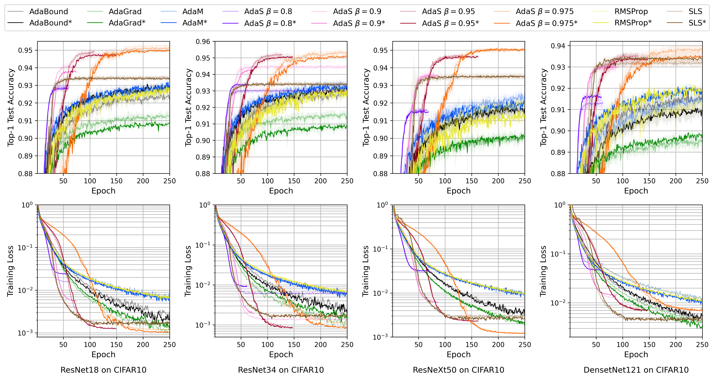
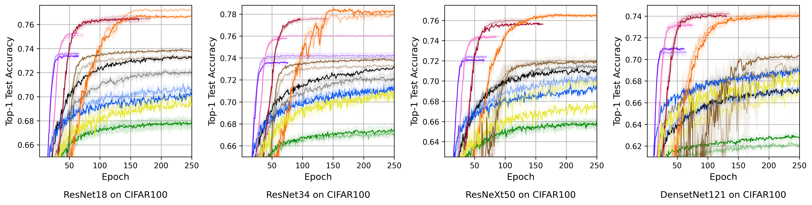
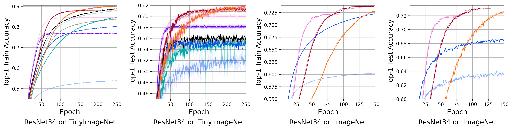
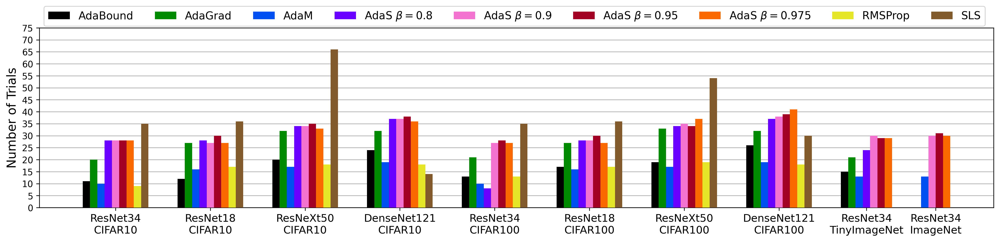

# autoHyper: Response Modeling of Hyper-Parameters for Deep Convolutional Neural Networks #
[Paper]()
## Status ##
[](LICENSE)
[](https://GitHub.com/Naereen/StrapDown.js/graphs/commit-activity)
[](https://www.python.org/downloads/release/python-370/)


## Table of Contents ##
- [autoHyper: Response Modeling of Hyper-Parameters for Deep Convolutional Neural Networks](#autohyper--response-modeling-of-hyper-parameters-for-deep-convolutional-neural-networks)
  * [Introduction](#introduction)
  * [License](#license)
  * [Citing autoHyper](#citing-autohyper)
  * [Requirements](#requirements)
    - [Software/Hardware](#software-hardware)
  * [Installation](#installation)
  * [Usage](#usage)
    - [Training Outputs](#training-outputs)
  * [Common Issues (running list)](#common-issues--running-list-)
  * [TODO](#todo)
  * [Pytest](#pytest)

<small><i><a href='http://ecotrust-canada.github.io/markdown-toc/'>Table of contents generated with markdown-toc</a></i></small>

### Introduction ###
[autoHyper]() is an algorithm that automatically determines the optimal initial learning rate for Neural Networks:
- it exhibits rapid convergence (on the order of minutes and hours)
- it generalizes well to model, dataset, optimizer selection (amoungst other experimental settings)
- it always achieves competitive performance (<1% difference on top-1 testing accuracy) and in some cases, drasticaly improves (such as a 4.93% increase in top-1 testing accuracy for ResNet34 trainined using AdaM applied on ImageNet)

This repository contains a [PyTorch](https://pytorch.org/) implementation of autoHyper.

Figure 1: Top-1 test accuracies for each experiment as well as training loss results for CIFAR10 experiments and top-1 training accuracies for TinyImageNet and ImageNet experiments. Titles below plots indicate what experiment the above plots refers to. Legend labels marked by `*' (opaque lines) show results for autoHyper generated learning rates and translucent lines are the baselines.




Figure 2: Computational analysis of autoHyper over various setups (number of learning rates autoHyper trialled before converging). ResNet34 trials take 3 minutes, 3 minutes, 18 minutes, and 220 minutes for CIFAR10, CIFAR100, TinyImageNet and, ImageNet, respectively. ResNet18, ResNeXt50, and DenseNet121 trials take 2 minutes, 3 minutes, and 3 minutes respectively for both CIFAR10 and CIFAR100.


### License ###
autoHyper is released under the MIT License (refer to the [LICENSE](LICENSE) file for more information)
|Permissions|Conditions|Limitations|
|---|---|---|
| Commerical use| License and Copyright Notice| Liability|
| Distribution| |  Warranty|
| Modification | | |
| Private Use| | |

### Citing autoHyper ###
```text
@misc{
}
```
### Requirements ###
#### Software/Hardware ####
We use `Python 3.7` (although compatibility with versions >= 3.7 *should not* pose an issue)

Refer [requirements.txt](requirements.txt) for the required Python Packages. Additional details can be found on the [Requirements Wiki](Requirements.md)

### Installation ###
There are two versions of the AdaS code contained in this repository.
1. a python-package version of the AdaS code, which can be `pip`-installed.
 - `pip install -e .` or `pip install .` will install the package
2. a static python module (unpackaged), runable as a script.

All source code can be found in [src/autohyper](src/autohyper).

### Usage ###
Moving forward, I will refer to console usage of this library. IDE usage is no different. Training options are split two ways:
1. First, all environment/infrastructure options (GPU usage, output paths, etc.) is specified using arguments.
2. Second, all training specific options (network, dataset, hyper-parameters, etc.) is specified using a [YAML](https://yaml.org/) configuration file.

For the packaged code, after installation, training can be run using the following command: `python -m autohyper train ...`

For the unpackaged code, training can be run using the following command: `python train.py ...` ([src/autohyper/train.py](src/autohyper/train.py))


```console
python -m autohyper train --help

usage: __main__.py train [-h] [--config CONFIG] [--data DATA]
                         [--output OUTPUT] [--checkpoint CHECKPOINT]
                         [--resume RESUME] [--root ROOT]
                         [--save-freq SAVE_FREQ] [--cpu] [--gpu GPU]
                         [--multiprocessing-distributed] [--dist-url DIST_URL]
                         [--dist-backend DIST_BACKEND]
                         [--world-size WORLD_SIZE] [--rank RANK]

optional arguments:
  -h, --help            show this help message and exit
  --config CONFIG       Set configuration file path: Default = 'config.yaml'
  --data DATA           Set data directory path: Default = '.autohyper-data'
  --output OUTPUT       Set output directory path: Default = '.autohyper-
                        output'
  --checkpoint CHECKPOINT
                        Set checkpoint directory path: Default = '.autohyper-
                        checkpoint'
  --resume RESUME       Set checkpoint resume path: Default = None
  --root ROOT           Set root path of project that parents all others:
                        Default = '.'
  --save-freq SAVE_FREQ
                        Checkpoint epoch save frequency: Default = 25
  --cpu                 Flag: CPU bound training: Default = False
  --gpu GPU             GPU id to use: Default = 0
  --multiprocessing-distributed
                        Use multi-processing distributed training to launch N
                        processes per node, which has N GPUs. This is the
                        fastest way to use PyTorch for either single node or
                        multi node data parallel training: Default = False
  --dist-url DIST_URL   url used to set up distributed training:Default =
                        'tcp://127.0.0.1:23456'
  --dist-backend DIST_BACKEND
                        distributed backend: Default = 'nccl'
  --world-size WORLD_SIZE
                        Number of nodes for distributed training: Default = -1
  --rank RANK           Node rank for distributed training: Default = -1
 ```
The following is an example config file:
```yaml
###### Application Specific ######
dataset: 'CIFAR10'
network: 'ResNet18CIFAR'
optimizer: 'AdaM'
scheduler: 'None'

###### Suggested Tune ######
init_lr: 0.01
early_stop_threshold: 0.001
optimizer_kwargs: {}
scheduler_kwargs: {}


###### Suggested Default ######
n_trials: 5
num_workers: 4
max_epochs: 100
loss: 'cross_entropy'
mini_batch_size: 128
early_stop_patience: 10
p: 1
```

Refer to the [Usage Wiki](Usage.md) for additional details.

#### Training Outputs ####
In addition to console outputs, all information is also logged in `csv` files during training.  Details can be foudn in the [Outputs Wiki](Outputs.md)

### Common Issues (running list) ###
- NONE :)

### TODO ###
- Extension of AdaS to Deep Neural Networks

### Pytest ###
Note the following:
- Our Pytests write/download data/files etc. to `/tmp`, so if you don't have a `/tmp` folder (i.e. you're on Windows), then correct this if you wish to run the tests yourself
